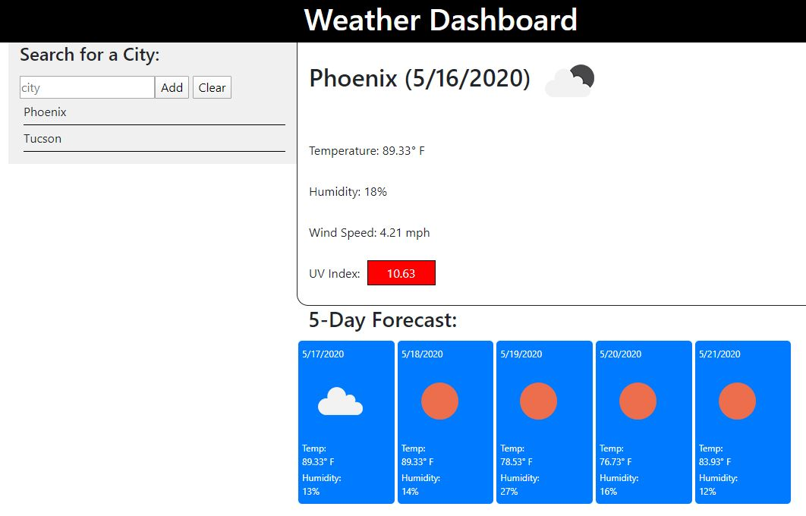

# hw-06-server-side-apis
Week 6 Homework

## About the Homework
This weeks homework was all about using server side APIs though ajax calls to request information. It was important for us to understand how to make the ajax "GET" requests, as well as how to find
and interpret the JSON data we received back. Understanding how to get the data you needed and putting that data in front of the user was the most important parts.

## Technology Used
For this weeks homework, I used Bootstrap for grid styling and mobile responsiveness, jQuery for DOM maniputlation and making the ajax calls, and moment.js to track dates. The APIs we used were
the OpenWeather Current Weather Data API, and the One Call API.

## End Result
The final application looked like this, with a city loaded:

And here is a gif of the application running, changing cities, and clearing the city list:

Finally, a snippet of important code. As mentioned above, the ajax method from jQuery was very important for making
calls to the API and handling the data. Here is an example of one such method in use:
